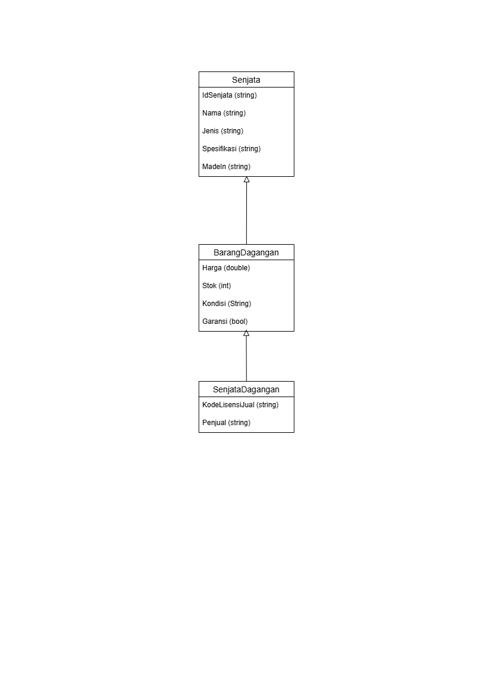
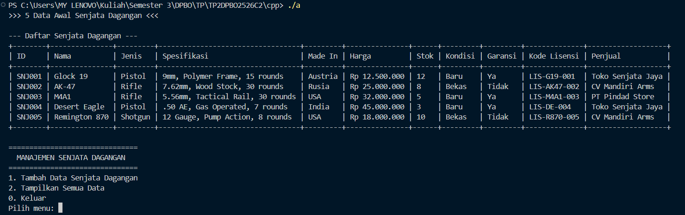
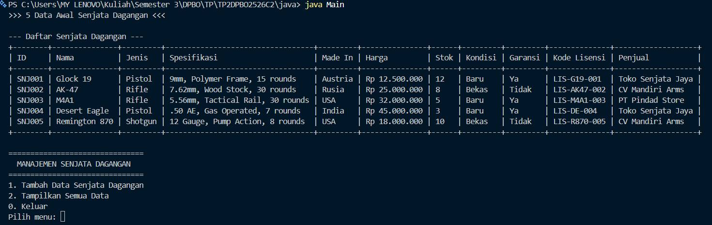
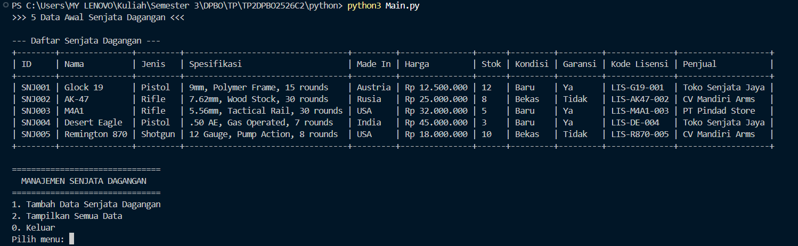
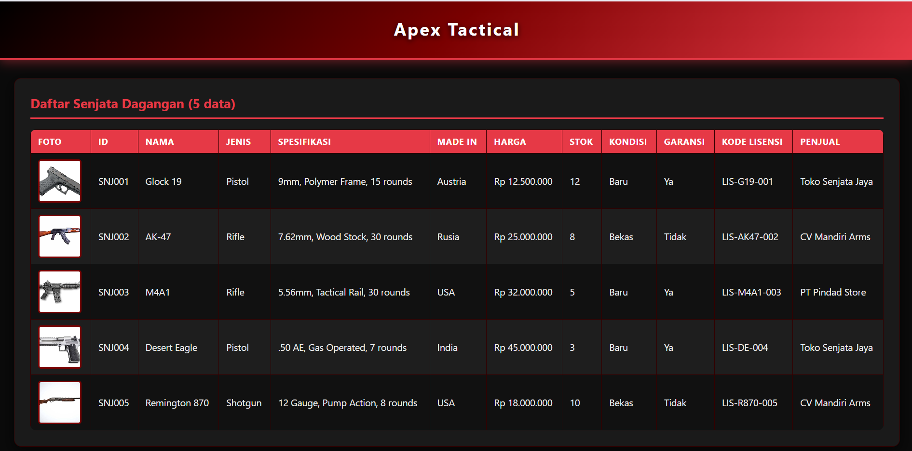
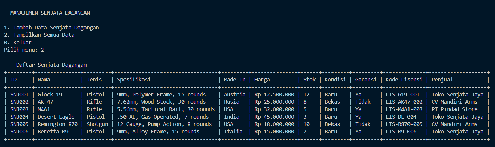
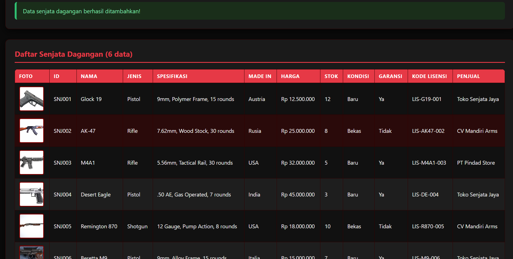
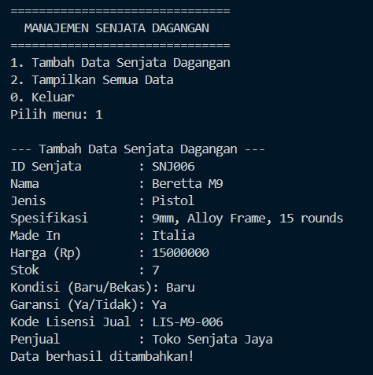
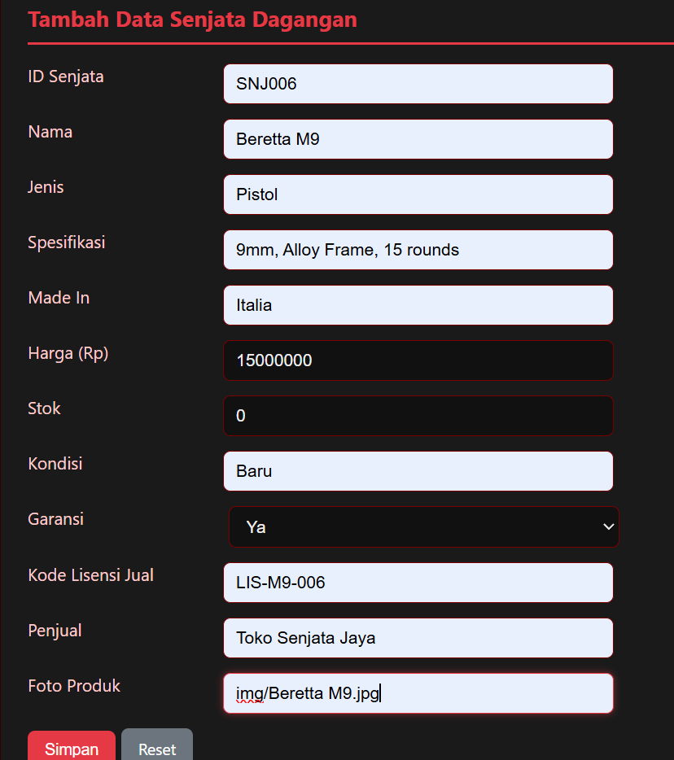

# TP2DPBO2526C2 - Multilevel Inheritance Senjata Dagangan

## JANJI
Saya Muhammad Hanif Muyassar dengan NIM 2510593 mengerjakan Tugas Praktikum 2 dalam mata kuliah Desain dan Pemrograman Berorientasi Objek untuk keberkahanNya maka saya tidak melakukan kecurangan seperti yang telah dispesifikasikan. Aamiin.

## DESAIN DIAGRAM
Diagram merepresentasikan **Multilevel Inheritance** (Senjata → BarangDagangan → SenjataDagangan):



### Relasi
- `Senjata` adalah **parent** (superclass)
- `BarangDagangan` **extends Senjata**
- `SenjataDagangan` **extends BarangDagangan** → otomatis mewarisi semua atribut dari `Senjata` + `BarangDagangan`

```
Senjata ──▷ BarangDagangan ──▷ SenjataDagangan
```

## PENJELASAN ATRIBUT & METHODS

### Class `Senjata` (`Senjata.py` / `Senjata.cpp` / `Senjata.java` / `Senjata.php:5`)
| Atribut | Tipe | Keterangan |
|---------|------|------------|
| `idSenjata` | string | ID unik senjata (key untuk cek duplikat) |
| `nama` | string | Nama senjata (contoh: Glock 19) |
| `jenis` | string | Jenis (Pistol / Rifle / Shotgun / SMG) |
| `spesifikasi` | string | Detail kaliber & fitur |
| `madeIn` | string | Negara pembuat |

### Class `BarangDagangan` extends Senjata (`BarangDagangan.py:1` / `BarangDagangan.cpp:1` / `BarangDagangan.java:1` / `BarangDagangan.php:4`)
| Atribut | Tipe | Keterangan |
|---------|------|------------|
| `harga` | double | Harga dalam Rupiah (>=0) |
| `stok` | int | Jumlah stok (>=0) |
| `kondisi` | string | Baru / Bekas |
| `garansi` | bool | Ya (true) / Tidak (false) |

### Class `SenjataDagangan` extends BarangDagangan (`SenjataDagangan.py:1` / `SenjataDagangan.cpp:1` / `SenjataDagangan.java:6` / `SenjataDagangan.php:4`)
| Atribut | Tipe | Keterangan |
|---------|------|------------|
| `kodeLisensiJual` | string | Kode lisensi penjualan |
| `penjual` | string | Nama penjual/toko |
| `foto_produk` | string | **KHUSUS PHP** - path lokal gambar produk (misal `img/glock19.jpg`) |

Setiap atribut bersifat `private`, diakses via **getter/setter**. Data disimpan dalam `list/vector/ArrayList` of `SenjataDagangan` (11 kolom total).

**Method kunci:**
- `toRow()` / `to_row()` → mengubah satu objek menjadi array/string list untuk tabel dinamis (kolom: ID, Nama, Jenis, Spesifikasi, MadeIn, Harga, Stok, Kondisi, Garansi, Kode Lisensi, Penjual [+ Foto untuk PHP])
- `cariIndexById()` → cek duplikat ID sebelum tambah data
- `cetakTabel()` / `cetak_tabel()` → hitung lebar kolom dinamis berdasarkan `max(len(header), len(data))`

## ALUR PROGRAM

### Versi CLI (C++, Java, Python)
1. Program **inisialisasi 5 objek awal** hardcode di `main()` sebelum interaksi user (memenuhi requirement "5 objek awal pada main"):
   - SNJ001 Glock 19 (Austria)
   - SNJ002 AK-47 (Rusia)
   - SNJ003 M4A1 (USA)
   - SNJ004 Desert Eagle (India)
   - SNJ005 Remington 870 (USA)
2. Tampilkan tabel dinamis berisi 5 data awal (header + garis `+---+`)
3. Loop menu:
   ```
   1. Tambah Data Senjata Dagangan
   2. Tampilkan Semua Data
   0. Keluar
   ```
4. Validasi input (mengulang sampai valid):
   - ID: tidak boleh kosong, tidak boleh duplikat
   - Nama/Jenis/Spesifikasi/MadeIn/Kondisi/Kode/Penjual: tidak boleh kosong
   - Harga: harus angka, >=0
   - Stok: harus int, >=0
   - Garansi: input `ya/y/true/1` → true, `tidak/t/false/0/n` → false, selain itu ulang
5. Saat `tampilkanData()` dipanggil, `cetakTabel()` menghitung lebar tiap kolom secara **dinamis** lalu mencetak tabel lengkap 11 kolom
6. Keluar → animasi loading + banner ASCII (konsisten dengan TP1)

### Versi Web (PHP)
1. `Senjata.php` → `BarangDagangan.php` → `SenjataDagangan.php` di-`require` sebelum `session_start()` (urutan penting untuk unserialize)
2. Data disimpan di `$_SESSION["senjata"]` (array of `SenjataDagangan`) — tanpa database, persist selama session
3. Saat load pertama, 5 objek awal dibuat otomatis jika session kosong
4. Setiap request:
   - `POST index.php` → validasi server-side (semua field required, harga/stok numeric, ID duplikat) lalu append ke session
   - Tabel HTML menampilkan **semua 12 kolom** termasuk foto (`` dengan `onerror` handling) + Harga format `Rp 12.500.000` + Garansi "Ya/Tidak"
5. Atribut `foto_produk` menyimpan **path lokal** (misal `img/glock19.jpg`) — khusus PHP sesuai Notes
6. Semua output via `htmlspecialchars()` untuk mencegah XSS

## STRUKTUR FOLDER
```
TP2DPBO2526C2/
├── cpp/
│   ├── Senjata.cpp
│   ├── BarangDagangan.cpp
│   ├── SenjataDagangan.cpp
│   ├── Main.cpp
│   └── input.txt
├── java/
│   ├── Senjata.java
│   ├── BarangDagangan.java
│   ├── SenjataDagangan.java
│   ├── Main.java
│   └── input.txt
├── python/
│   ├── Senjata.py
│   ├── BarangDagangan.py
│   ├── SenjataDagangan.py
│   ├── Main.py
│   └── input.txt
├── php/
│   ├── Senjata.php
│   ├── BarangDagangan.php
│   ├── SenjataDagangan.php
│   ├── index.php
│   ├── img/ (placeholder)
│   └── input.txt
├── dokumentasi/
│   ├── diagram.png
│   ├── cpp/
│   │   ├── tampilanAwal.png
│   │   ├── Show-cpp.png
│   │   └── Insert-cpp.png
│   ├── java/
│   │   ├── tampilanAwal.png
│   │   ├── Show-java.png
│   │   └── Insert-java.png
│   ├── python/
│   │   ├── tampilanAwal.png
│   │   ├── Show-py.png
│   │   └── Insert-py.png
│   └── php/
│       ├── tampilanAwal.png
│       ├── Show-php.png
│       └── Insert-php.png
└── README.md
```

## CARA MENJALANKAN

### Python
```bash
cd python
python Main.py
# Input testcase ada di python/input.txt
```

### C++
```bash
cd cpp
g++ Main.cpp -o Main
./Main
# atau pipe testcase: ./Main < input.txt
```

### Java
```bash
cd java
javac Senjata.java BarangDagangan.java SenjataDagangan.java Main.java
java Main
```

### PHP
```bash
cd php
php -S localhost:8000
# buka http://localhost:8000/index.php
```

## DOKUMENTASI OUTPUT
Program menampilkan tabel dinamis 11 kolom (12 dengan foto di PHP) secara lengkap + validasi input.

### Tampilan Awal (5 Data Awal Otomatis)
| C++ | Java |
|-----|------|
|  |  |
| **Python** | **PHP** |
|  |  |

### Menampilkan Semua Data (Tabel Dinamis Lengkap)
| C++ | Java |
|-----|------|
|  |  |
| **Python** | **PHP** |
|  |  |

### Menambahkan Data (Input User - Validasi)
| C++ | Java |
|-----|------|
|  |  |
| **Python** | **PHP** |
|  |  |

> Validasi yang terdokumentasi: ID tidak boleh kosong/duplikat, semua field required, harga/stok harus angka >=0, garansi Ya/Tidak.

---
